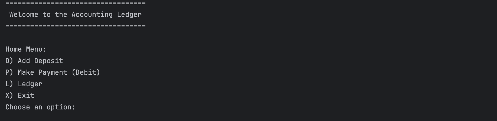
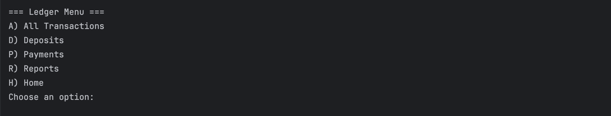
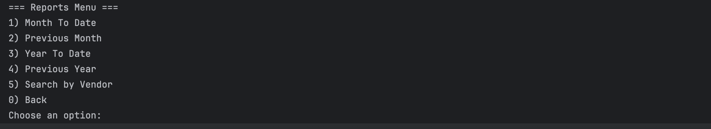
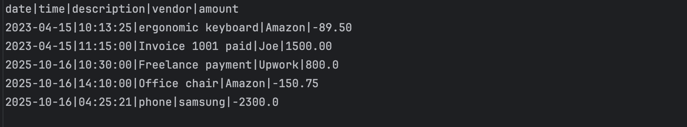
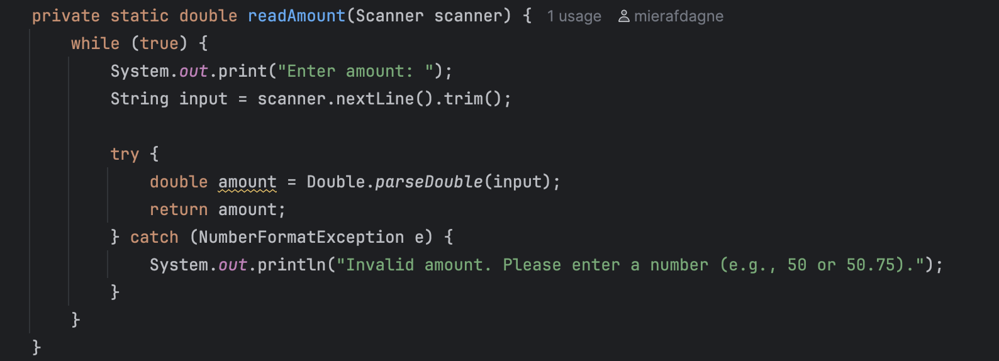
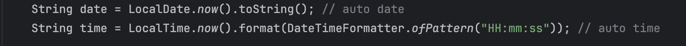
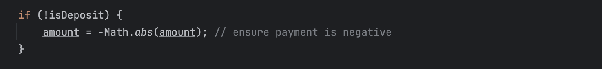

---

# 🧾 Accounting Ledger Application

## 📘 Overview

This project is a **console-based Accounting Ledger Application** built in **Java**.
It allows users to record and track their financial transactions including **deposits**, **payments**, and **vendor searches** all saved automatically to a file for future use.

The project demonstrates **object-oriented programming (OOP)**, **file input/output (I/O)**, **data validation**, and **date filtering**.

---

## 🎯 Purpose

The goal of this project was to simulate a simple accounting system with persistent storage.
It provides a real-world example of how an accounting ledger could function while reinforcing key programming skills such as:

* File handling using `BufferedReader` and `BufferedWriter`
* Data encapsulation and modular design
* Input validation and exception handling
* Filtering and reporting with date comparisons

---

## ⚙️ Key Features

* Add **Deposits** and **Payments (Debits)** with automatic date and time
* Save all data to `Data/transactions.csv`
* View all transactions, deposits only, or payments only
* Generate reports (Month-to-date, Year-to-date, etc.)
* Search transactions by vendor name

---

## 🧩 Project Structure

```
src/
└── com/pluralsight/
    ├── LedgerApp.java                 # Main program flow and menu system
    ├── Transaction.java               # Model class for a single transaction
    ├── TransactionFileManager.java    # Handles reading/writing the CSV file
    └── ReportGenerator.java           # Generates reports
└── transactions.csv                   # Stores all transactions persistently
```

---

## 🧱 Class-by-Class Breakdown

### 🏷 **1. Transaction.java**

Represents a single transaction record.

#### **Fields**

```java
private String date;
private String time;
private String description;
private String vendor;
private double amount;
```

#### **Constructor**

```java
public Transaction(String date, String time, String description, String vendor, double amount)
```

* Initializes a transaction with all necessary details.

#### **Methods**

| Method             | Description                                                          |
| ------------------ | -------------------------------------------------------------------- |
| `getDate()`        | Returns the transaction date.                                        |
| `getTime()`        | Returns the transaction time.                                        |
| `getDescription()` | Returns the description.                                             |
| `getVendor()`      | Returns the vendor name.                                             |
| `getAmount()`      | Returns the transaction amount.                                      |
| `toString()`       | Returns a formatted string of all fields for display in the console. |

Example output:

```
2025-10-16 | 14:25:32 | Freelance Work | Upwork | $850.00
```

---

### 📁 **2. TransactionFileManager.java**

Handles all **file operations** (reading and writing transactions).
Stores data in `transactions.csv` in a consistent format.

#### **Fields**

```java
private static final String FILE_PATH = "transactions.csv";
```

#### **Methods**

| Method                                                       | Description                                                                                                           |
|--------------------------------------------------------------| --------------------------------------------------------------------------------------------------------------------- |
| `public static void addTransaction(Transaction transaction)` | Appends a single transaction to the CSV file. If the file doesn’t exist, it creates one.                              |
| `public static List<Transaction> readTransactions()`         | Reads all transactions from the CSV file and returns them as a `List<Transaction>`. Skips the header line if present. |
| `private static void ensureFileExists()`                     | Checks if the `transactions.csv` file exists; creates it if not.                                                      |

#### **File Format**

Each record is saved in this format:

```
date|time|description|vendor|amount
```

Example:

```
2025-10-15|09:23:10|Coffee|Starbucks|-4.75
```

---

### 💻 **3. LedgerApp.java**

The **main class** that runs the program.
Handles all user interaction, menus, and program control flow.

#### **Key Methods**

| Method                                                                   | Description                                                                                                                                       |
| ------------------------------------------------------------------------ |---------------------------------------------------------------------------------------------------------------------------------------------------|
| `public static void main(String[] args)`                                 | Entry point, displays the main menu and loops until the user exits.                                                                               |
| `private static void addTransaction(Scanner scanner, boolean isDeposit)` | Prompts the user for description, vendor, and amount, then creates and saves the transaction. Automatically applies negative values for payments. |
| `private static double readAmount(Scanner scanner)`                      | Validates that the amount entered by the user is a valid number (handles incorrect input).                                                        |
| `private static void showLedgerMenu(Scanner scanner)`                    | Displays the ledger submenu where users can view all, deposits, or payments.                                                                      |
| `private static void showReportsMenu(Scanner scanner)`                   | Displays the reports submenu and lets users select filters (month-to-date, vendor search, etc.).                                                  |

#### **Menus**

**Home Menu**



**Ledger Menu**



**Reports Menu**



---

### 📊 **4. ReportGenerator.java**

Handles generating different **filtered reports** from all transactions.

#### **Methods**

| Method                                                                             | Description                                                   |
| ---------------------------------------------------------------------------------- | ------------------------------------------------------------- |
| `public static void monthToDate(List<Transaction> transactions)`                   | Displays all transactions that occurred in the current month. |
| `public static void previousMonth(List<Transaction> transactions)`                 | Displays transactions from the last calendar month.           |
| `public static void yearToDate(List<Transaction> transactions)`                    | Displays all transactions for the current year.               |
| `public static void previousYear(List<Transaction> transactions)`                  | Displays all transactions from the previous year.             |
| `public static void searchByVendor(List<Transaction> transactions, String vendor)` | Searches for transactions matching a specific vendor name.    |

Each method filters transactions by comparing their `LocalDate` with the current date and prints results to the console.

---

## 💾 Example Data (transactions.csv)


## 🚀 How to Run

### Option 1: Run in IntelliJ

1. Open the project folder in **IntelliJ IDEA**.
2. Right-click `LedgerApp.java` → **Run 'LedgerApp.main()'**.
3. The menu appears in the console.

### Option 2: Run from Command Line

```bash
javac -d out src/com/pluralsight/*.java
java -cp out com.pluralsight.LedgerApp
```

---

## 💡 Interesting Code Highlights

### 🧮 1. Smart Amount Validation

To prevent crashes from invalid user input (like typing “abc” instead of a number), the program uses a **validation loop** that keeps prompting until a valid amount is entered:


🧠 *Why it’s interesting:*
This shows **defensive programming** — anticipating user mistakes and keeping the app stable and user-friendly.

---

### 💰 2. Automatic Date and Time Stamping

Each transaction automatically records the **current date and time**, eliminating manual input errors and ensuring consistent, accurate records:


🧠 *Why it’s interesting:*
It demonstrates efficient use of Java’s `LocalDate` and `LocalTime` classes, keeping the program’s data clean and dependable for reporting.

---

### 📂 3. Auto-Negative Payments

When a user records a payment, the app automatically converts the entered amount into a negative value — ensuring financial accuracy without extra user steps.



🧠 *Why it’s interesting:*
This tiny but clever line keeps all debits consistent, prevents accounting errors, and shows thoughtful attention to logic and data integrity.

---

## 🧠 Lessons Learned

* Applying **OOP design principles** in real projects
* Using **file I/O** for persistent data
* Validating user input and preventing runtime errors
* Handling **date-based filtering** with Java’s `LocalDate` and `LocalTime`
* Designing clean, modular code for easier debugging and maintenance

---

